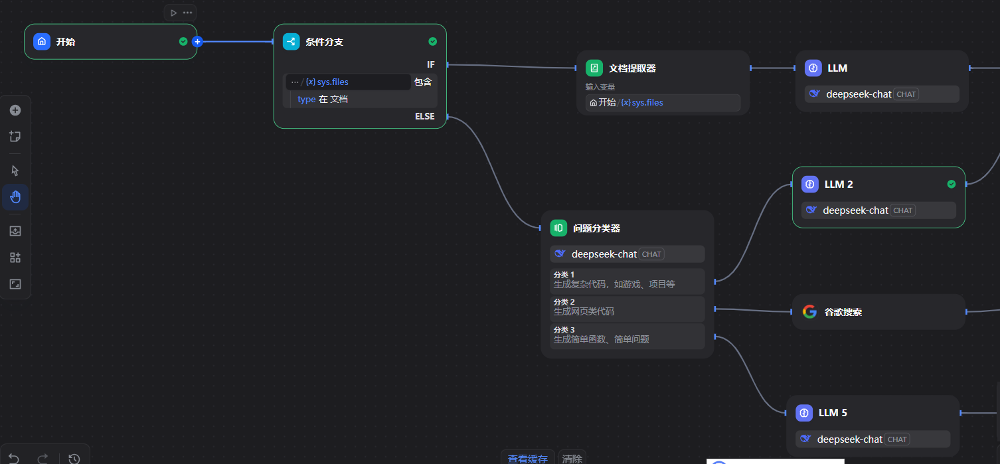
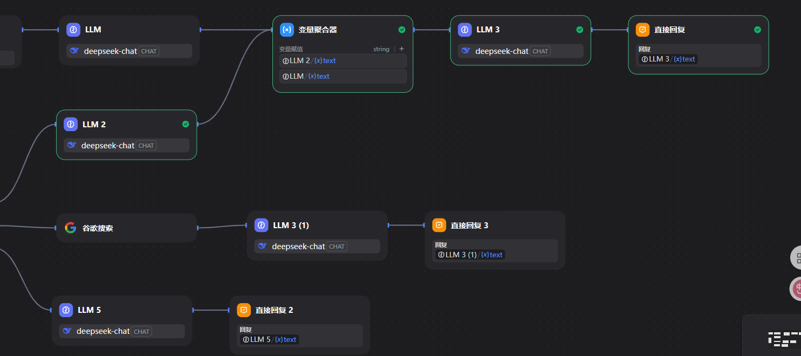
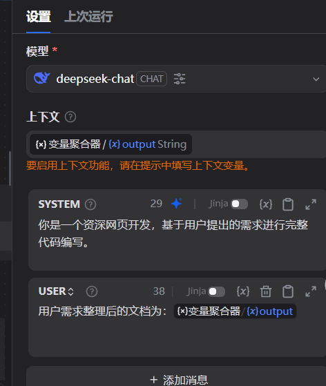
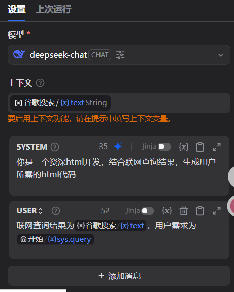
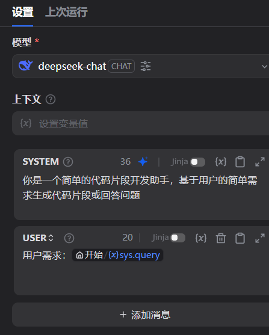

# Dify 平台代码生成助手 Pro 应用开发实践

## 项目概述

本项目基于 Dify 平台构建了一个智能代码生成助手 Pro 应用，能够根据用户需求自动生成各种类型的代码，包括完整的 Web 应用、游戏和网站等。

## 应用架构设计

### 工作流程图
简易代码生成 Agent 采用智能分流设计，工作流程如下：
1. **条件判断**：检测用户是否上传了需求文件
2. **问题分类**：根据需求复杂度进行智能分类
3. **路径选择**：
   - 复杂项目：需求设计 → 代码编写
   - 网页设计：Google 搜索 → 代码设计
   - 简单片段：直接进入片段生成

### 多模型适配策略
针对不同的代码生成场景，配置了专门的提示词模板和用户输入处理：

## 关键功能模块

### 1. 复杂项目生成器
适用于需要完整架构设计的项目开发：

**特点**：
- 支持需求文档上传
- 自动进行架构设计
- 生成完整的项目代码结构

### 2. HTML 生成器
专门用于网页和网站的快速开发：

**特点**：
- 集成 Google 搜索能力
- 参考最新的设计趋势
- 生成响应式网页代码

### 3. 简单片段生成器
用于快速生成代码片段和小型功能：

**特点**：
- 快速响应
- 直接输出可用代码
- 支持多种编程语言

## 实际应用案例

### 案例一：贪吃蛇游戏开发

**需求描述**：开发一个具有完整游戏逻辑的贪吃蛇游戏

**生成结果**：
- 完整的 HTML5 Canvas 游戏
- 包含游戏逻辑、UI 界面、控制系统
- 支持键盘控制和移动端触摸操作

**代码文件**：[贪吃蛇游戏完整代码](贪吃蛇.md)

### 案例二：DeepSeek 官网开发

**需求描述**：仿制 DeepSeek 官网，包含现代化设计和响应式布局

**生成结果**：
- 现代化的渐变背景设计
- 响应式导航栏和页面布局
- 专业的 AI 平台展示页面

**代码文件**：[DeepSeek 官网代码](官网.md)

## 开发步骤总结

### 1. 应用创建与配置
1. 在 Dify 平台创建新的工作流应用
2. 设计智能分流的条件判断节点
3. 配置不同场景的 LLM 节点

### 2. 提示词工程
1. 为不同代码生成场景设计专门的提示词
2. 优化输出格式，确保代码的可用性
3. 添加错误处理和边界情况处理

### 3. 集成外部工具
1. 集成 Google 搜索 API 获取最新技术信息
2. 配置文件上传功能支持需求文档处理
3. 设置多模型切换机制

### 4. 测试与优化
1. 使用不同复杂度的需求进行测试
2. 优化生成代码的质量和可维护性
3. 调整工作流程提高生成效率

## 技术特色

- **智能分流**：根据需求复杂度自动选择最适合的处理路径
- **多模型协作**：不同场景使用最适合的 LLM 模型
- **实时搜索**：集成搜索能力获取最新技术资料
- **文档驱动**：支持上传需求文档进行精确开发

## 项目文件

- [贪吃蛇游戏源码](贪吃蛇.md) - 完整的 HTML5 游戏实现
- [DeepSeek 官网源码](官网.md) - 响应式网站页面实现

## 总结

通过 Dify 平台成功构建了一个功能完善的代码生成助手 Pro 应用，能够处理从简单代码片段到复杂项目的各种开发需求。应用采用智能分流机制，针对不同场景提供最优的生成策略，大大提高了代码生成的效率和质量。