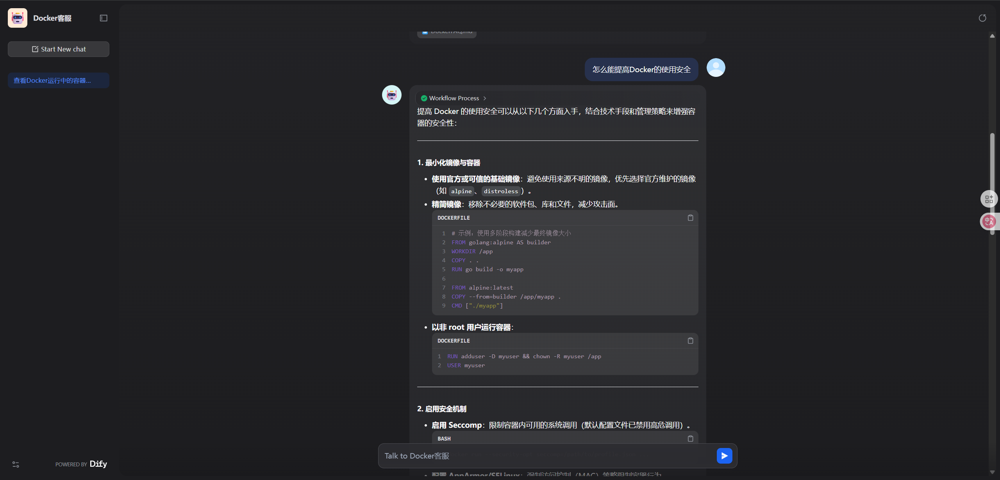

# Dify智能客服作业报告

## 作业内容
使用 Dify 的 Chatflow 完成"Docker智能客服"机器人的搭建，优化系统提示词，发布并提交测试问题。

**访问地址：** https://udify.app/chat/NSRvKPhsyDfBli9E

## 1. 关键步骤描述

### 步骤1：创建Chatflow应用
- 在Dify平台创建新的Chatflow应用
- 选择智能客服场景模板
- 配置基础对话流程

### 步骤2：上传知识文档
- 上传Docker相关技术文档
- 包含100个Docker问答题
- 完成知识库向量化处理

### 步骤3：优化系统提示词
- 调整机器人角色定位
- 优化回答风格和准确性
- 设置专业领域约束

### 步骤4：测试发布
- 发布智能客服机器人
- 进行多轮测试验证
- 优化用户体验

## 2. 优化后的系统提示词

```
你是一个专业的Docker技术客服，具有丰富的容器技术经验。你的任务是：

1. 基于知识库准确回答Docker相关技术问题
2. 回答要专业、简洁、易懂
3. 如果问题超出Docker范围，礼貌地提醒用户
4. 提供实用的代码示例和最佳实践
5. 保持友好和耐心的服务态度

回答格式要求：
- 先给出核心答案
- 提供必要的代码示例
- 补充相关注意事项
```

## 3. 系统流程


## 4. 知识库配置


## 5. 测试问题及结果

### 测试问题1


### 测试问题2  


### 测试问题3


## 总结

通过本次作业，成功搭建了基于Dify的Docker智能客服系统，实现了：
- 准确的技术问答能力
- 良好的用户交互体验
- 专业的知识库支撑
- 高效的响应速度