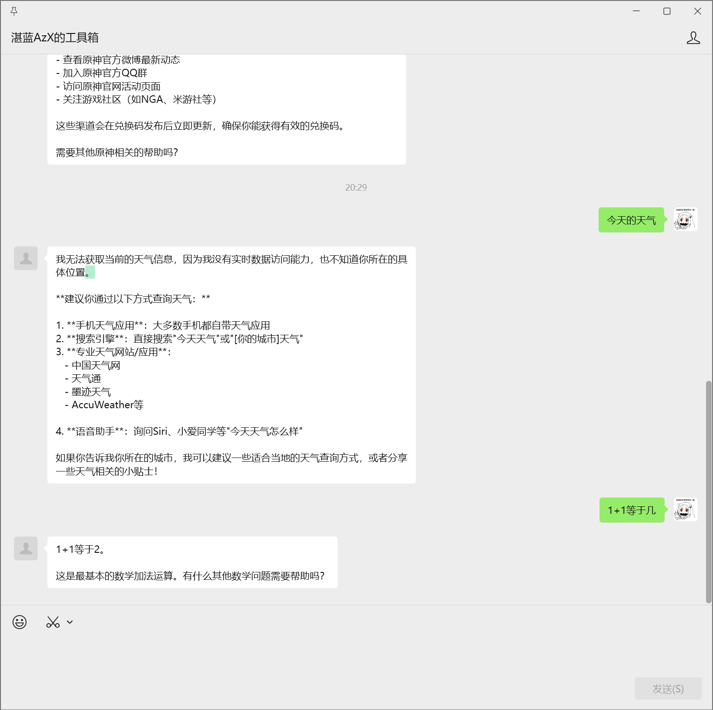

```log
ubuntu@VM-8-6-ubuntu:~/LangBot$ docker logs langbot
/app/.venv/lib/python3.12/site-packages/nakuru/misc.py:50: SyntaxWarning: invalid escape sequence '\['
  for m in re.compile("(\[CQ:(.+?)])").finditer(text):
[09-01 20:17:01.195] mgr.py (39) - [INFO] : Initializing database...
[09-01 20:17:01.234] mgr.py (57) - [INFO] : Creating initial metadata...
[09-01 20:17:01.245] manager.py (73) - [INFO] : Loading all plugins...
[09-01 20:17:01.267] modelmgr.py (61) - [INFO] : Loading models from db...
[09-01 20:17:01.616] botmgr.py (202) - [INFO] : Loading bots from db...
[09-01 20:17:01.619] pipelinemgr.py (239) - [INFO] : Loading pipelines from db...
[09-01 20:17:01.620] kbmgr.py (226) - [INFO] : Loading knowledge bases from db...
[09-01 20:17:01.802] app.py (197) - [INFO] : =======================================
[09-01 20:17:01.802] app.py (197) - [INFO] : ✨ Access WebUI / 访问管理面板
[09-01 20:17:01.802] app.py (197) - [INFO] : 
[09-01 20:17:01.803] app.py (197) - [INFO] : 🏠 Local Address: http://127.0.0.1:5300/
[09-01 20:17:01.803] app.py (197) - [INFO] : 🌐 Public Address: http://<Your Public IP>:5300/
[09-01 20:17:01.803] app.py (197) - [INFO] : 
[09-01 20:17:01.803] app.py (197) - [INFO] : 📌 Running this program in a container? Please ensure that the 5300 port is exposed
[09-01 20:17:01.803] app.py (197) - [INFO] : =======================================
[09-01 20:17:03.005] show_notes.py (32) - [INFO] : Current Version: v4.2.2
[2025-09-01 20:17:03 +0800] [10] [INFO] Running on http://0.0.0.0:5300 (CTRL + C to quit)

 _                   ___      _   
| |   __ _ _ _  __ _| _ ) ___| |_ 
| |__/ _` | ' \/ _` | _ \/ _ \  _|
|____\__,_|_||_\__, |___/\___/\__|
               |___/              

⭐️ Open Source 开源地址: https://github.com/langbot-app/LangBot
📖 Documentation 文档地址: https://docs.langbot.app

[Startup] Prechecking plugin dependencies...
[2025-09-01 20:17:16 +0800] [10] [INFO] 188.253.120.76:25093 POST /api/v1/platform/bots 1.1 200 77 16844
[2025-09-01 20:17:16 +0800] [10] [INFO] 188.253.120.76:25093 GET /api/v1/pipelines 1.1 200 2052 5760
[2025-09-01 20:17:16 +0800] [10] [INFO] 188.253.120.76:25093 GET /api/v1/pipelines 1.1 200 2052 4322
[2025-09-01 20:17:17 +0800] [10] [INFO] 188.253.120.76:32661 GET /api/v1/platform/adapters 1.1 200 15826 3729
[2025-09-01 20:17:17 +0800] [10] [INFO] 188.253.120.76:25093 GET /api/v1/platform/adapters 1.1 200 15826 3039
[2025-09-01 20:17:17 +0800] [10] [INFO] 188.253.120.76:25093 GET /api/v1/platform/bots/e8b660f8-5cd7-4f9d-8872-9875c08e5663 1.1 200 717 4036
[2025-09-01 20:17:17 +0800] [10] [INFO] 188.253.120.76:5621 GET /api/v1/platform/adapters 1.1 200 15826 3750
[2025-09-01 20:17:17 +0800] [10] [INFO] 188.253.120.76:32661 GET /api/v1/platform/bots 1.1 200 720 3332
[2025-09-01 20:17:18 +0800] [10] [INFO] 188.253.120.76:5621 GET /api/v1/platform/bots/e8b660f8-5cd7-4f9d-8872-9875c08e5663 1.1 200 717 3700
[2025-09-01 20:17:25 +0800] [10] [INFO] 188.253.120.76:21203 PUT /api/v1/platform/bots/e8b660f8-5cd7-4f9d-8872-9875c08e5663 1.1 200 34 12868
[2025-09-01 20:17:25 +0800] [10] [INFO] 188.253.120.76:21203 GET /api/v1/platform/adapters 1.1 200 15826 3945
[2025-09-01 20:17:25 +0800] [10] [INFO] 188.253.120.76:21203 GET /api/v1/platform/bots 1.1 200 720 3572
[2025-09-01 20:17:31 +0800] [10] [INFO] 188.253.120.76:27799 GET /home/models.txt 1.1 200 5581 2671
[2025-09-01 20:17:31 +0800] [10] [INFO] 188.253.120.76:27799 GET /api/v1/provider/requesters 1.1 200 10537 3827
[2025-09-01 20:17:32 +0800] [10] [INFO] 188.253.120.76:27799 GET /api/v1/provider/models/llm 1.1 200 43 3435
[2025-09-01 20:17:32 +0800] [10] [INFO] 188.253.120.76:24079 GET /api/v1/provider/requesters 1.1 200 5658 3347
[2025-09-01 20:17:32 +0800] [10] [INFO] 188.253.120.76:24079 GET /api/v1/provider/models/embedding 1.1 200 43 3383
[2025-09-01 20:17:32 +0800] [10] [INFO] 188.253.120.76:27799 GET /api/v1/provider/requesters 1.1 200 10537 3363
[2025-09-01 20:18:47 +0800] [10] [INFO] 188.253.120.76:21557 POST /api/v1/provider/models/llm/_/test 1.1 200 34 3258765
[2025-09-01 20:18:49 +0800] [10] [INFO] 188.253.120.76:21557 POST /api/v1/provider/models/llm 1.1 200 77 58172
[2025-09-01 20:18:49 +0800] [10] [INFO] 188.253.120.76:21557 GET /api/v1/provider/requesters 1.1 200 10537 3636
[2025-09-01 20:18:49 +0800] [10] [INFO] 188.253.120.76:21557 GET /api/v1/provider/models/llm 1.1 200 470 3636
[2025-09-01 20:18:50 +0800] [10] [INFO] 188.253.120.76:21557 GET /api/v1/provider/requesters/openrouter-chat-completions/icon 1.1 200 2461 2485
[2025-09-01 20:18:50 +0800] [10] [INFO] 188.253.120.76:21557 GET /home/bots.txt 1.1 200 5503 2628
[2025-09-01 20:18:51 +0800] [10] [INFO] 188.253.120.76:21557 GET /api/v1/platform/adapters 1.1 200 15826 3112
[2025-09-01 20:18:51 +0800] [10] [INFO] 188.253.120.76:21557 GET /api/v1/platform/bots 1.1 200 720 3378
[2025-09-01 20:18:52 +0800] [10] [INFO] 188.253.120.76:21557 GET /api/v1/pipelines 1.1 200 2088 4000
[2025-09-01 20:18:52 +0800] [10] [INFO] 188.253.120.76:21557 GET /api/v1/platform/adapters 1.1 200 15826 3258
[2025-09-01 20:18:52 +0800] [10] [INFO] 188.253.120.76:21557 GET /api/v1/platform/bots/e8b660f8-5cd7-4f9d-8872-9875c08e5663 1.1 200 717 4352
[2025-09-01 20:18:58 +0800] [10] [INFO] 188.253.120.76:14829 GET /home/pipelines.txt 1.1 200 5523 2404
[2025-09-01 20:18:58 +0800] [10] [INFO] 188.253.120.76:14829 GET /_next/static/chunks/448-7ceee8d5172b33ee.js 1.1 200 24699 3436
[2025-09-01 20:18:58 +0800] [10] [INFO] 188.253.120.76:14189 GET /_next/static/chunks/app/home/pipelines/page-7e0c8020ab6350fa.js 1.1 200 30626 3668
[2025-09-01 20:18:59 +0800] [10] [INFO] 188.253.120.76:14829 GET /api/v1/pipelines 1.1 200 2088 4368
[2025-09-01 20:18:59 +0800] [10] [INFO] 188.253.120.76:14189 GET /api/v1/pipelines/1a3b777d-34b4-4ca1-b0f5-1e732199a54f 1.1 200 2085 4420
[2025-09-01 20:18:59 +0800] [10] [INFO] 188.253.120.76:14829 GET /api/v1/pipelines/_/metadata 1.1 200 18599 2571
[2025-09-01 20:19:01 +0800] [10] [INFO] 188.253.120.76:14829 GET /api/v1/provider/models/llm 1.1 200 470 4193
[2025-09-01 20:19:01 +0800] [10] [INFO] 188.253.120.76:14189 GET /api/v1/knowledge/bases 1.1 200 42 3755
[2025-09-01 20:19:07 +0800] [10] [INFO] 188.253.120.76:7243 PUT /api/v1/pipelines/1a3b777d-34b4-4ca1-b0f5-1e732199a54f 1.1 200 34 15807
[2025-09-01 20:19:07 +0800] [10] [INFO] 188.253.120.76:7243 GET /api/v1/pipelines 1.1 200 2086 4633
[2025-09-01 20:20:03 +0800] [10] [INFO] 188.253.120.76:19363 GET /api/v1/knowledge/bases 1.1 200 42 5769
[2025-09-01 20:20:03 +0800] [10] [INFO] 188.253.120.76:21947 GET /api/v1/provider/models/llm 1.1 200 470 6080
[2025-09-01 20:20:05 +0800] [10] [INFO] 188.253.120.76:21947 PUT /api/v1/pipelines/1a3b777d-34b4-4ca1-b0f5-1e732199a54f 1.1 200 34 19517
[2025-09-01 20:20:05 +0800] [10] [INFO] 188.253.120.76:21947 GET /api/v1/pipelines 1.1 200 2086 3801
[2025-09-01 20:20:07 +0800] [10] [INFO] 188.253.120.76:21947 GET /api/v1/platform/adapters 1.1 200 15826 3561
[2025-09-01 20:20:07 +0800] [10] [INFO] 188.253.120.76:21947 GET /api/v1/platform/bots 1.1 200 720 3705
[2025-09-01 20:20:08 +0800] [10] [INFO] 188.253.120.76:21947 PUT /api/v1/platform/bots/e8b660f8-5cd7-4f9d-8872-9875c08e5663 1.1 200 34 10283
[2025-09-01 20:20:08 +0800] [10] [INFO] Running on http://0.0.0.0:2287 (CTRL + C to quit)
[2025-09-01 20:20:12 +0800] [10] [INFO] 124.223.188.110:25688 GET /callback/command 1.0 200 19 964
Traceback (most recent call last):
  File "/app/libs/official_account_api/api.py", line 75, in handle_callback_request
    xml_msg = xml_msg.decode('utf-8')
              ^^^^^^^^^^^^^^
AttributeError: 'NoneType' object has no attribute 'decode'
[2025-09-01 20:20:56 +0800] [10] [INFO] 81.69.103.129:13364 POST /callback/command 1.1 500 265 2292
Traceback (most recent call last):
  File "/app/libs/official_account_api/api.py", line 75, in handle_callback_request
    xml_msg = xml_msg.decode('utf-8')
              ^^^^^^^^^^^^^^
AttributeError: 'NoneType' object has no attribute 'decode'
[2025-09-01 20:20:56 +0800] [10] [INFO] 121.4.104.160:43224 POST /callback/command 1.1 500 265 2027
Traceback (most recent call last):
  File "/app/libs/official_account_api/api.py", line 75, in handle_callback_request
    xml_msg = xml_msg.decode('utf-8')
              ^^^^^^^^^^^^^^
AttributeError: 'NoneType' object has no attribute 'decode'
[2025-09-01 20:20:56 +0800] [10] [INFO] 81.69.103.129:14492 POST /callback/command 1.1 500 265 1912
Traceback (most recent call last):
  File "/app/libs/official_account_api/api.py", line 75, in handle_callback_request
    xml_msg = xml_msg.decode('utf-8')
              ^^^^^^^^^^^^^^
AttributeError: 'NoneType' object has no attribute 'decode'
[2025-09-01 20:21:23 +0800] [10] [INFO] 124.223.33.44:60510 POST /callback/command 1.1 500 265 1791
Traceback (most recent call last):
  File "/app/libs/official_account_api/api.py", line 75, in handle_callback_request
    xml_msg = xml_msg.decode('utf-8')
              ^^^^^^^^^^^^^^
AttributeError: 'NoneType' object has no attribute 'decode'
[2025-09-01 20:21:23 +0800] [10] [INFO] 111.229.150.102:34336 POST /callback/command 1.1 500 265 2292
Traceback (most recent call last):
  File "/app/libs/official_account_api/api.py", line 75, in handle_callback_request
    xml_msg = xml_msg.decode('utf-8')
              ^^^^^^^^^^^^^^
AttributeError: 'NoneType' object has no attribute 'decode'
[2025-09-01 20:21:23 +0800] [10] [INFO] 175.24.214.150:43554 POST /callback/command 1.1 500 265 1754
[2025-09-01 20:21:30 +0800] [10] [INFO] 188.253.120.76:5675 GET /api/v1/pipelines 1.1 200 2086 3930
[2025-09-01 20:21:30 +0800] [10] [INFO] 188.253.120.76:5675 GET /api/v1/platform/adapters 1.1 200 15826 3028
[2025-09-01 20:21:30 +0800] [10] [INFO] 188.253.120.76:5675 GET /api/v1/platform/bots/e8b660f8-5cd7-4f9d-8872-9875c08e5663 1.1 200 716 3949
[2025-09-01 20:21:36 +0800] [10] [INFO] 188.253.120.76:23611 GET /api/v1/pipelines 1.1 200 2086 3960
[2025-09-01 20:21:37 +0800] [10] [INFO] 188.253.120.76:23611 GET /api/v1/pipelines/1a3b777d-34b4-4ca1-b0f5-1e732199a54f 1.1 200 2083 4096
[2025-09-01 20:21:37 +0800] [10] [INFO] 188.253.120.76:7923 GET /api/v1/pipelines/_/metadata 1.1 200 18599 2856
[2025-09-01 20:21:38 +0800] [10] [INFO] 188.253.120.76:23611 GET /api/v1/knowledge/bases 1.1 200 42 3944
[2025-09-01 20:21:38 +0800] [10] [INFO] 188.253.120.76:7923 GET /api/v1/provider/models/llm 1.1 200 470 3035
[2025-09-01 20:22:07 +0800] [10] [INFO] 188.253.120.76:14523 PUT /api/v1/pipelines/1a3b777d-34b4-4ca1-b0f5-1e732199a54f 1.1 200 34 18233
[2025-09-01 20:22:07 +0800] [10] [INFO] Running on http://0.0.0.0:2287 (CTRL + C to quit)
[2025-09-01 20:22:07 +0800] [10] [INFO] 188.253.120.76:14523 GET /api/v1/pipelines 1.1 200 2082 3870
[2025-09-01 20:22:09 +0800] [10] [INFO] 188.253.120.76:14523 GET /api/v1/platform/adapters 1.1 200 15826 3407
[2025-09-01 20:22:09 +0800] [10] [INFO] 188.253.120.76:14523 GET /api/v1/platform/bots 1.1 200 719 4616
[2025-09-01 20:22:09 +0800] [10] [INFO] 188.253.120.76:14523 GET /api/v1/pipelines 1.1 200 2082 3808
[2025-09-01 20:22:10 +0800] [10] [INFO] 188.253.120.76:14523 GET /api/v1/platform/adapters 1.1 200 15826 3068
[2025-09-01 20:22:10 +0800] [10] [INFO] 188.253.120.76:14523 GET /api/v1/platform/bots/e8b660f8-5cd7-4f9d-8872-9875c08e5663 1.1 200 716 3976
[2025-09-01 20:22:29 +0800] [10] [INFO] 124.223.188.110:13368 GET /callback/command 1.0 200 18 735
[09-01 20:22:43.610] process.py (39) - [INFO] : Processing request from person_oaGTn16uurmWuex-GBOVWpVh-hv8 (0): 你好
[09-01 20:22:47.051] chat.py (98) - [INFO] : 对话(0)响应: assistant: 你好！很高兴见到你...
[2025-09-01 20:22:47 +0800] [10] [INFO] 124.222.246.206:52020 POST /callback/command 1.1 200 327 3520759
[09-01 20:23:01.112] process.py (39) - [INFO] : Processing request from person_oaGTn16uurmWuex-GBOVWpVh-hv8 (1): 提供一下最近的原神前瞻兑换码
[2025-09-01 20:23:05 +0800] [10] [INFO] 175.24.212.195:57760 POST /callback/command 1.1 500 265 4826385
[09-01 20:23:07.344] chat.py (98) - [INFO] : 对话(1)响应: assistant: 我无法提供最新的原...
[2025-09-01 20:23:07 +0800] [10] [INFO] 81.69.101.193:55918 POST /callback/command 1.1 200 900 1310430
[2025-09-01 20:23:25 +0800] [10] [INFO] 188.253.120.76:30181 GET /api/v1/pipelines 1.1 200 2082 3749
[2025-09-01 20:23:25 +0800] [10] [INFO] 188.253.120.76:30181 GET /api/v1/pipelines/1a3b777d-34b4-4ca1-b0f5-1e732199a54f 1.1 200 2079 3913
[2025-09-01 20:23:25 +0800] [10] [INFO] 188.253.120.76:18247 GET /api/v1/pipelines/_/metadata 1.1 200 18599 2792
[2025-09-01 20:23:26 +0800] [10] [INFO] 188.253.120.76:18247 GET /api/v1/pipelines/1a3b777d-34b4-4ca1-b0f5-1e732199a54f/chat/messages/person 1.1 200 45 2456
[2025-09-01 20:23:26 +0800] [10] [INFO] 188.253.120.76:18247 GET /api/v1/pipelines/1a3b777d-34b4-4ca1-b0f5-1e732199a54f/chat/messages/person 1.1 200 45 2806
[2025-09-01 20:23:28 +0800] [10] [INFO] 188.253.120.76:18247 GET /api/v1/pipelines/_/metadata 1.1 200 18599 6736
[2025-09-01 20:23:28 +0800] [10] [INFO] 188.253.120.76:30181 GET /api/v1/pipelines/1a3b777d-34b4-4ca1-b0f5-1e732199a54f 1.1 200 2079 8395
[2025-09-01 20:23:28 +0800] [10] [INFO] 188.253.120.76:30181 GET /api/v1/knowledge/bases 1.1 200 42 4296
[2025-09-01 20:23:28 +0800] [10] [INFO] 188.253.120.76:18247 GET /api/v1/provider/models/llm 1.1 200 470 6692
[2025-09-01 20:23:36 +0800] [10] [INFO] 188.253.120.76:15811 GET /api/v1/platform/adapters 1.1 200 15826 2910
[2025-09-01 20:23:36 +0800] [10] [INFO] 188.253.120.76:15811 GET /api/v1/platform/bots 1.1 200 719 3891
[2025-09-01 20:23:37 +0800] [10] [INFO] 188.253.120.76:15811 GET /home/models.txt 1.1 200 5581 2169
[2025-09-01 20:23:38 +0800] [10] [INFO] 188.253.120.76:15811 GET /api/v1/provider/requesters 1.1 200 10537 3245
[2025-09-01 20:23:38 +0800] [10] [INFO] 188.253.120.76:15811 GET /api/v1/provider/models/llm 1.1 200 470 3836
[2025-09-01 20:23:38 +0800] [10] [INFO] 188.253.120.76:5609 GET /api/v1/provider/requesters 1.1 200 5658 2609
[2025-09-01 20:23:38 +0800] [10] [INFO] 188.253.120.76:5609 GET /api/v1/provider/models/embedding 1.1 200 43 3453
[2025-09-01 20:23:39 +0800] [10] [INFO] 188.253.120.76:5609 GET /api/v1/provider/requesters 1.1 200 10537 3318
[2025-09-01 20:23:40 +0800] [10] [INFO] 188.253.120.76:5609 GET /api/v1/provider/models/llm/0e4c42e2-ec4a-4fb6-838d-854fe32a4d8d 1.1 200 467 3719
[2025-09-01 20:23:44 +0800] [10] [INFO] 188.253.120.76:5609 PUT /api/v1/provider/models/llm/0e4c42e2-ec4a-4fb6-838d-854fe32a4d8d 1.1 200 34 58523
[2025-09-01 20:23:44 +0800] [10] [INFO] 188.253.120.76:5609 GET /api/v1/provider/requesters 1.1 200 10537 3638
[2025-09-01 20:23:44 +0800] [10] [INFO] 188.253.120.76:5609 GET /api/v1/provider/models/llm 1.1 200 488 3840
[2025-09-01 20:23:45 +0800] [10] [INFO] 188.253.120.76:5609 GET /api/v1/provider/requesters 1.1 200 10537 3038
[2025-09-01 20:23:45 +0800] [10] [INFO] 188.253.120.76:5609 GET /api/v1/provider/models/llm/0e4c42e2-ec4a-4fb6-838d-854fe32a4d8d 1.1 200 485 4665
[2025-09-01 20:23:48 +0800] [10] [INFO] 188.253.120.76:5609 POST /api/v1/provider/models/llm/_/test 1.1 200 34 2325071
[2025-09-01 20:23:49 +0800] [10] [INFO] 188.253.120.76:5609 PUT /api/v1/provider/models/llm/0e4c42e2-ec4a-4fb6-838d-854fe32a4d8d 1.1 200 34 44265
[2025-09-01 20:23:50 +0800] [10] [INFO] 188.253.120.76:5609 GET /api/v1/provider/requesters 1.1 200 10537 3719
[2025-09-01 20:23:50 +0800] [10] [INFO] 188.253.120.76:5609 GET /api/v1/provider/models/llm 1.1 200 488 3913
[2025-09-01 20:23:51 +0800] [10] [INFO] 188.253.120.76:5609 GET /api/v1/provider/requesters 1.1 200 10537 3276
[2025-09-01 20:23:51 +0800] [10] [INFO] 188.253.120.76:5609 GET /api/v1/provider/models/llm/0e4c42e2-ec4a-4fb6-838d-854fe32a4d8d 1.1 200 485 3836
[09-01 20:24:00.099] process.py (39) - [INFO] : Processing request from person_oaGTn16uurmWuex-GBOVWpVh-hv8 (2): 提供一下最近的原神前瞻兑换码
[2025-09-01 20:24:04 +0800] [10] [INFO] 175.24.211.157:49010 POST /callback/command 1.1 500 265 4825988
[09-01 20:24:07.144] chat.py (98) - [INFO] : 对话(2)响应: assistant: 抱歉，我无法提供最...
[2025-09-01 20:24:07 +0800] [10] [INFO] 175.24.211.4:40174 POST /callback/command 1.1 200 890 2116630
[2025-09-01 20:24:17 +0800] [10] [INFO] 188.253.120.76:1163 GET /api/v1/provider/requesters 1.1 200 10537 3714
[2025-09-01 20:24:17 +0800] [10] [INFO] 188.253.120.76:1163 GET /api/v1/provider/models/llm/0e4c42e2-ec4a-4fb6-838d-854fe32a4d8d 1.1 200 485 4101
[2025-09-01 20:24:40 +0800] [10] [INFO] 188.253.120.76:17817 GET /home/knowledge.txt 1.1 200 5385 2608
[2025-09-01 20:24:40 +0800] [10] [INFO] 188.253.120.76:17817 GET /_next/static/chunks/767-eaf4a1e5b6c2c690.js 1.1 200 81592 4996
[2025-09-01 20:24:40 +0800] [10] [INFO] 188.253.120.76:12007 GET /_next/static/chunks/app/home/knowledge/page-bb89fe786cd1f652.js 1.1 200 30728 3364
[2025-09-01 20:24:40 +0800] [10] [INFO] 188.253.120.76:32963 GET /home/plugins.txt 1.1 200 5421 2545
[2025-09-01 20:24:41 +0800] [10] [INFO] 188.253.120.76:32963 GET /_next/static/chunks/26-b9f6acf6832300da.js 1.1 200 59498 3928
[2025-09-01 20:24:41 +0800] [10] [INFO] 188.253.120.76:12007 GET /_next/static/css/560b46fe0c14c0cb.css 1.1 200 336 1972
[2025-09-01 20:24:41 +0800] [10] [INFO] 188.253.120.76:17817 GET /_next/static/chunks/app/home/plugins/page-f386b0bb9f6c5009.js 1.1 200 29473 3376
[2025-09-01 20:24:41 +0800] [10] [INFO] 188.253.120.76:17817 GET /api/v1/plugins 1.1 200 44 3114
[2025-09-01 20:25:10 +0800] [10] [INFO] 188.253.120.76:21407 GET /api/v1/plugins 1.1 200 44 2998
[2025-09-01 20:25:13 +0800] [10] [INFO] 188.253.120.76:21407 PUT /api/v1/plugins/reorder 1.1 200 34 3112
[2025-09-01 20:25:20 +0800] [10] [INFO] 180.101.245.253:54678 GET / 1.1 200 5993 2229
[2025-09-01 20:25:20 +0800] [10] [INFO] 106.55.245.27:5790 GET /_next/static/chunks/4bd1b696-a94929371110d7b8.js 1.1 200 169106 7182
[2025-09-01 20:25:20 +0800] [10] [INFO] 106.55.245.27:5790 GET /_next/static/chunks/684-3b42a1fa06208dba.js 1.1 200 173188 9356
[2025-09-01 20:25:20 +0800] [10] [INFO] 106.55.245.27:5790 GET /_next/static/chunks/218-38507444714fc669.js 1.1 200 4781 1957
[2025-09-01 20:25:20 +0800] [10] [INFO] 106.55.245.27:5790 GET /_next/static/chunks/671-51398447a13b8d6b.js 1.1 200 33916 2979
[2025-09-01 20:25:20 +0800] [10] [INFO] 106.55.245.27:5790 GET /_next/static/chunks/211-badaa30ec9599341.js 1.1 200 50558 4074
[2025-09-01 20:25:20 +0800] [10] [INFO] 106.55.245.27:5790 GET /_next/static/chunks/867-67948cd08c1399db.js 1.1 200 48920 3071
[2025-09-01 20:25:20 +0800] [10] [INFO] 106.55.245.27:5790 GET /_next/static/chunks/app/layout-215528d6f5d34cb5.js 1.1 200 4479 2371
[2025-09-01 20:25:21 +0800] [10] [INFO] 220.196.160.124:39482 GET / 1.1 200 5993 2387
[2025-09-01 20:25:21 +0800] [10] [INFO] 220.196.160.124:39482 GET /_next/static/css/300df08b002b20ef.css 1.1 200 76492 4420
[2025-09-01 20:25:21 +0800] [10] [INFO] 220.196.160.124:39516 GET /_next/static/chunks/webpack-821e4e0e3b55c3e2.js 1.1 200 3454 2371
[2025-09-01 20:25:21 +0800] [10] [INFO] 220.196.160.124:39522 GET /_next/static/chunks/main-app-5a26bdfdc3c8384d.js 1.1 200 506 7764
[2025-09-01 20:25:21 +0800] [10] [INFO] 220.196.160.124:39524 GET /_next/static/chunks/218-38507444714fc669.js 1.1 200 4781 6548
[2025-09-01 20:25:21 +0800] [10] [INFO] 220.196.160.124:39482 GET /_next/static/chunks/671-51398447a13b8d6b.js 1.1 200 33916 9202
[2025-09-01 20:25:21 +0800] [10] [INFO] 220.196.160.124:39520 GET /_next/static/chunks/4bd1b696-a94929371110d7b8.js 1.1 200 169106 39922
[2025-09-01 20:25:21 +0800] [10] [INFO] 220.196.160.124:39518 GET /_next/static/chunks/684-3b42a1fa06208dba.js 1.1 200 173188 77896
[2025-09-01 20:25:21 +0800] [10] [INFO] 220.196.160.124:39516 GET /_next/static/chunks/211-badaa30ec9599341.js 1.1 200 50558 4256
[2025-09-01 20:25:21 +0800] [10] [INFO] 220.196.160.124:39522 GET /_next/static/chunks/867-67948cd08c1399db.js 1.1 200 48920 4029
[2025-09-01 20:25:21 +0800] [10] [INFO] 220.196.160.124:39482 GET /_next/static/chunks/app/layout-215528d6f5d34cb5.js 1.1 200 4479 1972
[2025-09-01 20:25:21 +0800] [10] [INFO] 220.196.160.124:39524 GET /_next/static/chunks/352-e63dc3cca5d20bfa.js 1.1 200 27541 3056
[2025-09-01 20:25:21 +0800] [10] [INFO] 220.196.160.124:39520 GET /_next/static/chunks/app/not-found-58770fc2bf6717fa.js 1.1 200 3516 3716
[2025-09-01 20:25:21 +0800] [10] [INFO] 220.196.160.124:39518 GET /_next/static/chunks/app/page-dd7c7d53ce049343.js 1.1 200 589 2862
[2025-09-01 20:25:22 +0800] [10] [INFO] 220.196.160.124:39522 GET /login.txt 1.1 200 4057 2259
[2025-09-01 20:25:22 +0800] [10] [INFO] 220.196.160.124:39516 GET /_next/static/chunks/app/login/layout-cae93a84512b371e.js 1.1 200 430 2305
[2025-09-01 20:25:22 +0800] [10] [INFO] 220.196.160.124:39482 GET /_next/static/chunks/app/login/page-bc85a9116880c1d2.js 1.1 200 10670 3091
[2025-09-01 20:25:22 +0800] [10] [INFO] 220.196.160.124:39520 GET /_next/static/chunks/126-c51451b41f0e7506.js 1.1 200 11829 6168
[2025-09-01 20:25:22 +0800] [10] [INFO] 220.196.160.124:39524 GET /_next/static/chunks/554-ce2ba400c86a574d.js 1.1 200 13690 5517
[2025-09-01 20:25:22 +0800] [10] [INFO] 220.196.160.124:39518 GET /_next/static/chunks/726-d3e73d8e922bb1d1.js 1.1 200 75638 18048
[2025-09-01 20:25:22 +0800] [10] [INFO] 220.196.160.124:39522 GET /_next/static/chunks/301-a062b199220cd9e4.js 1.1 200 147368 20257
[2025-09-01 20:25:22 +0800] [10] [INFO] 220.196.160.124:39522 GET /api/v1/system/info 1.1 200 91 913
[2025-09-01 20:25:22 +0800] [10] [INFO] 220.196.160.124:39518 GET /_next/static/media/langbot-logo.d39c63cb.webp 1.1 200 13922 2783
[2025-09-01 20:25:22 +0800] [10] [INFO] 220.196.160.124:39518 GET /api/v1/user/init 1.1 200 50 3026
[2025-09-01 20:25:22 +0800] [10] [INFO] 220.196.160.124:39522 GET /api/v1/user/check-token 1.1 401 40 704
[2025-09-01 20:25:22 +0800] [10] [INFO] 220.196.160.124:39524 GET /reset-password.txt 1.1 200 3964 2369
[2025-09-01 20:25:22 +0800] [10] [INFO] 220.196.160.124:39524 GET /_next/static/chunks/app/reset-password/layout-c34a2b46912913e2.js 1.1 200 430 3791
[2025-09-01 20:25:22 +0800] [10] [INFO] 220.196.160.124:39518 GET /_next/static/chunks/app/reset-password/page-c596da998cee82fa.js 1.1 200 16192 6181
[2025-09-01 20:25:33 +0800] [10] [INFO] 14.152.83.80:36296 GET /_next/static/media/langbot-logo.d39c63cb.webp 1.1 200 13922 2933
[2025-09-01 20:25:44 +0800] [10] [INFO] 188.253.120.76:9637 POST /api/v1/plugins/install/github 1.1 200 44 3116
WARNING: pip is being invoked by an old script wrapper. This will fail in a future version of pip.
Please see https://github.com/pypa/pip/issues/5599 for advice on fixing the underlying issue.
To avoid this problem you can invoke Python with '-m pip' instead of running pip directly.
Looking in indexes: https://pypi.tuna.tsinghua.edu.cn/simple
Requirement already satisfied: beautifulsoup4 in ./.venv/lib/python3.12/site-packages (from -r plugins/WebwlkrPlugin/requirements.txt (line 1)) (4.13.5)
Requirement already satisfied: PyYaml in ./.venv/lib/python3.12/site-packages (from -r plugins/WebwlkrPlugin/requirements.txt (line 2)) (6.0.2)
Requirement already satisfied: requests in ./.venv/lib/python3.12/site-packages (from -r plugins/WebwlkrPlugin/requirements.txt (line 3)) (2.32.5)
Requirement already satisfied: soupsieve>1.2 in ./.venv/lib/python3.12/site-packages (from beautifulsoup4->-r plugins/WebwlkrPlugin/requirements.txt (line 1)) (2.8)
Requirement already satisfied: typing-extensions>=4.0.0 in ./.venv/lib/python3.12/site-packages (from beautifulsoup4->-r plugins/WebwlkrPlugin/requirements.txt (line 1)) (4.15.0)
Requirement already satisfied: charset_normalizer<4,>=2 in ./.venv/lib/python3.12/site-packages (from requests->-r plugins/WebwlkrPlugin/requirements.txt (line 3)) (3.4.3)
Requirement already satisfied: idna<4,>=2.5 in ./.venv/lib/python3.12/site-packages (from requests->-r plugins/WebwlkrPlugin/requirements.txt (line 3)) (3.10)
Requirement already satisfied: urllib3<3,>=1.21.1 in ./.venv/lib/python3.12/site-packages (from requests->-r plugins/WebwlkrPlugin/requirements.txt (line 3)) (2.5.0)
Requirement already satisfied: certifi>=2017.4.17 in ./.venv/lib/python3.12/site-packages (from requests->-r plugins/WebwlkrPlugin/requirements.txt (line 3)) (2025.8.3)
[09-01 20:25:46.688] app.py (221) - [INFO] : Hot reload scope=plugin
Hot reload scope=plugin
[09-01 20:25:46.692] manager.py (73) - [INFO] : Loading all plugins...
Loading all plugins...
[09-01 20:25:46.694] classic.py (186) - [ERROR] : 加载插件模块 WebwlkrPlugin.main 时发生错误
ERROR: 加载插件模块 WebwlkrPlugin.main 时发生错误
Traceback (most recent call last):
  File "/app/pkg/plugin/loaders/classic.py", line 180, in _walk_plugin_path
    importlib.import_module(module.__name__ + '.' + item.name)
  File "/usr/local/lib/python3.12/importlib/__init__.py", line 90, in import_module
    return _bootstrap._gcd_import(name[level:], package, level)
           ^^^^^^^^^^^^^^^^^^^^^^^^^^^^^^^^^^^^^^^^^^^^^^^^^^^^
  File "<frozen importlib._bootstrap>", line 1387, in _gcd_import
  File "<frozen importlib._bootstrap>", line 1360, in _find_and_load
  File "<frozen importlib._bootstrap>", line 1331, in _find_and_load_unlocked
  File "<frozen importlib._bootstrap>", line 935, in _load_unlocked
  File "<frozen importlib._bootstrap_external>", line 995, in exec_module
  File "<frozen importlib._bootstrap>", line 488, in _call_with_frames_removed
  File "/app/plugins/WebwlkrPlugin/main.py", line 2, in <module>
    from pkg.plugin.host import EventContext, PluginHost
ImportError: cannot import name 'EventContext' from 'pkg.plugin.host' (/app/pkg/plugin/host.py)
[2025-09-01 20:25:46 +0800] [10] [INFO] 188.253.120.76:9637 GET /api/v1/system/tasks/11 1.1 200 773 2621
[2025-09-01 20:25:47 +0800] [10] [INFO] 188.253.120.76:32967 GET /api/v1/system/tasks/11 1.1 200 773 2779
[2025-09-01 20:26:00 +0800] [10] [INFO] 188.253.120.76:7671 GET /api/v1/knowledge/bases 1.1 200 42 3423
[2025-09-01 20:26:01 +0800] [10] [INFO] 188.253.120.76:7671 GET /home/pipelines.txt 1.1 200 5523 2948
[2025-09-01 20:26:01 +0800] [10] [INFO] 188.253.120.76:7671 GET /api/v1/pipelines 1.1 200 2082 4613
[2025-09-01 20:26:01 +0800] [10] [INFO] 188.253.120.76:7671 GET /api/v1/provider/requesters 1.1 200 10537 3223
[2025-09-01 20:26:01 +0800] [10] [INFO] 188.253.120.76:7671 GET /api/v1/provider/models/llm 1.1 200 488 4200
[2025-09-01 20:26:01 +0800] [10] [INFO] 188.253.120.76:10881 GET /api/v1/provider/requesters 1.1 200 5658 3084
[2025-09-01 20:26:01 +0800] [10] [INFO] 188.253.120.76:10881 GET /api/v1/provider/models/embedding 1.1 200 43 4009
[2025-09-01 20:26:02 +0800] [10] [INFO] 188.253.120.76:10881 GET /home/bots.txt 1.1 200 5503 2816
[2025-09-01 20:26:02 +0800] [10] [INFO] 188.253.120.76:10881 GET /api/v1/platform/adapters 1.1 200 15826 3044
[2025-09-01 20:26:02 +0800] [10] [INFO] 188.253.120.76:10881 GET /api/v1/platform/bots 1.1 200 719 4321
[2025-09-01 20:26:03 +0800] [10] [INFO] 188.253.120.76:10881 GET /api/v1/plugins 1.1 200 44 3074
[2025-09-01 20:26:05 +0800] [10] [INFO] 188.253.120.76:10881 GET /home/plugins 1.1 200 24418 3490
[2025-09-01 20:26:05 +0800] [10] [INFO] 188.253.120.76:7671 GET /_next/static/media/langbot-logo.d39c63cb.webp 1.1 200 13922 3349
[2025-09-01 20:26:06 +0800] [10] [INFO] 188.253.120.76:10881 GET /_next/static/chunks/webpack-821e4e0e3b55c3e2.js 1.1 200 3454 2871
[2025-09-01 20:26:06 +0800] [10] [INFO] 188.253.120.76:30347 GET /_next/static/css/560b46fe0c14c0cb.css 1.1 200 336 2316
[2025-09-01 20:26:06 +0800] [10] [INFO] 188.253.120.76:11389 GET /_next/static/css/b2dd2ba914343e1e.css 1.1 200 4028 2256
[2025-09-01 20:26:06 +0800] [10] [INFO] 188.253.120.76:10881 GET /_next/static/chunks/684-3b42a1fa06208dba.js 1.1 200 173188 44527
[2025-09-01 20:26:06 +0800] [10] [INFO] 188.253.120.76:30347 GET /_next/static/chunks/main-app-5a26bdfdc3c8384d.js 1.1 200 506 2160
[2025-09-01 20:26:06 +0800] [10] [INFO] 188.253.120.76:9011 GET /_next/static/chunks/4bd1b696-a94929371110d7b8.js 1.1 200 169106 70057
[2025-09-01 20:26:06 +0800] [10] [INFO] 188.253.120.76:11389 GET /_next/static/chunks/218-38507444714fc669.js 1.1 200 4781 2109
[2025-09-01 20:26:06 +0800] [10] [INFO] 188.253.120.76:7671 GET /_next/static/chunks/671-51398447a13b8d6b.js 1.1 200 33916 4325
[2025-09-01 20:26:06 +0800] [10] [INFO] 188.253.120.76:30347 GET /_next/static/chunks/211-badaa30ec9599341.js 1.1 200 50558 4556
[2025-09-01 20:26:06 +0800] [10] [INFO] 188.253.120.76:27803 GET /_next/static/css/300df08b002b20ef.css 1.1 200 76492 5239
[2025-09-01 20:26:06 +0800] [10] [INFO] 188.253.120.76:11389 GET /_next/static/chunks/867-67948cd08c1399db.js 1.1 200 48920 3849
[2025-09-01 20:26:06 +0800] [10] [INFO] 188.253.120.76:10881 GET /_next/static/chunks/app/layout-215528d6f5d34cb5.js 1.1 200 4479 2238
[2025-09-01 20:26:06 +0800] [10] [INFO] 188.253.120.76:10881 GET /_next/static/chunks/352-e63dc3cca5d20bfa.js 1.1 200 27541 3601
[2025-09-01 20:26:06 +0800] [10] [INFO] 188.253.120.76:7671 GET /_next/static/chunks/app/not-found-58770fc2bf6717fa.js 1.1 200 3516 2245
[2025-09-01 20:26:06 +0800] [10] [INFO] 188.253.120.76:11389 GET /_next/static/chunks/301-a062b199220cd9e4.js 1.1 200 147368 8541
[2025-09-01 20:26:06 +0800] [10] [INFO] 188.253.120.76:9011 GET /_next/static/chunks/225-440df4d3e97488e2.js 1.1 200 12145 4571
[2025-09-01 20:26:06 +0800] [10] [INFO] 188.253.120.76:10881 GET /_next/static/chunks/726-d3e73d8e922bb1d1.js 1.1 200 75638 11165
[2025-09-01 20:26:06 +0800] [10] [INFO] 188.253.120.76:27803 GET /_next/static/chunks/100-bbadde3fd395b833.js 1.1 200 24896 4319
[2025-09-01 20:26:06 +0800] [10] [INFO] 188.253.120.76:7671 GET /_next/static/chunks/554-ce2ba400c86a574d.js 1.1 200 13690 2854
[2025-09-01 20:26:06 +0800] [10] [INFO] 188.253.120.76:10881 GET /_next/static/chunks/app/home/layout-61b25f8388d60c95.js 1.1 200 31206 5363
[2025-09-01 20:26:06 +0800] [10] [INFO] 188.253.120.76:30347 GET /_next/static/chunks/26-b9f6acf6832300da.js 1.1 200 59498 5385
[2025-09-01 20:26:07 +0800] [10] [INFO] 188.253.120.76:7671 GET /_next/static/chunks/977-44697de0f2bd009c.js 1.1 200 19526 3257
[2025-09-01 20:26:07 +0800] [10] [INFO] 188.253.120.76:11389 GET /_next/static/chunks/app/home/plugins/page-f386b0bb9f6c5009.js 1.1 200 29473 3551
[2025-09-01 20:26:07 +0800] [10] [INFO] 188.253.120.76:17609 GET /home/plugins 1.1 200 24418 3110
[2025-09-01 20:26:07 +0800] [10] [INFO] 188.253.120.76:27803 GET /api/v1/system/info 1.1 200 91 1104
[2025-09-01 20:26:07 +0800] [10] [INFO] 188.253.120.76:9011 GET /_next/static/media/langbot-logo.d39c63cb.webp 1.1 200 13922 2835
[2025-09-01 20:26:07 +0800] [10] [INFO] 188.253.120.76:27803 GET /_next/static/media/langbot-logo.d39c63cb.webp 1.1 200 13922 2912
[2025-09-01 20:26:07 +0800] [10] [INFO] 188.253.120.76:11389 GET /_next/static/media/langbot-logo.d39c63cb.webp 1.1 200 13922 2838
[2025-09-01 20:26:07 +0800] [10] [INFO] 188.253.120.76:30347 GET /api/v1/plugins 1.1 200 44 2616
[2025-09-01 20:26:08 +0800] [10] [INFO] 188.253.120.76:11389 GET /favicon.ico 1.1 200 9662 2815
[2025-09-01 20:26:31 +0800] [10] [INFO] 188.253.120.76:5143 POST /api/v1/plugins/install/github 1.1 200 44 3104
WARNING: pip is being invoked by an old script wrapper. This will fail in a future version of pip.
Please see https://github.com/pypa/pip/issues/5599 for advice on fixing the underlying issue.
To avoid this problem you can invoke Python with '-m pip' instead of running pip directly.
Looking in indexes: https://pypi.tuna.tsinghua.edu.cn/simple
[09-01 20:26:33.015] app.py (221) - [INFO] : Hot reload scope=plugin
Hot reload scope=plugin
[09-01 20:26:33.019] manager.py (73) - [INFO] : Loading all plugins...
Loading all plugins...
[09-01 20:26:33.023] classic.py (186) - [ERROR] : 加载插件模块 WebwlkrPlugin.main 时发生错误
ERROR: 加载插件模块 WebwlkrPlugin.main 时发生错误
Traceback (most recent call last):
  File "/app/pkg/plugin/loaders/classic.py", line 180, in _walk_plugin_path
    importlib.import_module(module.__name__ + '.' + item.name)
  File "/usr/local/lib/python3.12/importlib/__init__.py", line 90, in import_module
    return _bootstrap._gcd_import(name[level:], package, level)
           ^^^^^^^^^^^^^^^^^^^^^^^^^^^^^^^^^^^^^^^^^^^^^^^^^^^^
  File "<frozen importlib._bootstrap>", line 1387, in _gcd_import
  File "<frozen importlib._bootstrap>", line 1360, in _find_and_load
  File "<frozen importlib._bootstrap>", line 1331, in _find_and_load_unlocked
  File "<frozen importlib._bootstrap>", line 935, in _load_unlocked
  File "<frozen importlib._bootstrap_external>", line 995, in exec_module
  File "<frozen importlib._bootstrap>", line 488, in _call_with_frames_removed
  File "/app/plugins/WebwlkrPlugin/main.py", line 2, in <module>
    from pkg.plugin.host import EventContext, PluginHost
ImportError: cannot import name 'EventContext' from 'pkg.plugin.host' (/app/pkg/plugin/host.py)
[2025-09-01 20:26:33 +0800] [10] [INFO] 188.253.120.76:5143 GET /api/v1/system/tasks/12 1.1 200 773 2525
[2025-09-01 20:26:35 +0800] [10] [INFO] 188.253.120.76:5143 POST /api/v1/plugins/install/github 1.1 200 44 2547
WARNING: pip is being invoked by an old script wrapper. This will fail in a future version of pip.
Please see https://github.com/pypa/pip/issues/5599 for advice on fixing the underlying issue.
To avoid this problem you can invoke Python with '-m pip' instead of running pip directly.
Looking in indexes: https://pypi.tuna.tsinghua.edu.cn/simple
Requirement already satisfied: beautifulsoup4 in ./.venv/lib/python3.12/site-packages (from -r plugins/WebwlkrPlugin/requirements.txt (line 1)) (4.13.5)
Requirement already satisfied: PyYaml in ./.venv/lib/python3.12/site-packages (from -r plugins/WebwlkrPlugin/requirements.txt (line 2)) (6.0.2)
Requirement already satisfied: requests in ./.venv/lib/python3.12/site-packages (from -r plugins/WebwlkrPlugin/requirements.txt (line 3)) (2.32.5)
Requirement already satisfied: soupsieve>1.2 in ./.venv/lib/python3.12/site-packages (from beautifulsoup4->-r plugins/WebwlkrPlugin/requirements.txt (line 1)) (2.8)
Requirement already satisfied: typing-extensions>=4.0.0 in ./.venv/lib/python3.12/site-packages (from beautifulsoup4->-r plugins/WebwlkrPlugin/requirements.txt (line 1)) (4.15.0)
Requirement already satisfied: charset_normalizer<4,>=2 in ./.venv/lib/python3.12/site-packages (from requests->-r plugins/WebwlkrPlugin/requirements.txt (line 3)) (3.4.3)
Requirement already satisfied: idna<4,>=2.5 in ./.venv/lib/python3.12/site-packages (from requests->-r plugins/WebwlkrPlugin/requirements.txt (line 3)) (3.10)
Requirement already satisfied: urllib3<3,>=1.21.1 in ./.venv/lib/python3.12/site-packages (from requests->-r plugins/WebwlkrPlugin/requirements.txt (line 3)) (2.5.0)
Requirement already satisfied: certifi>=2017.4.17 in ./.venv/lib/python3.12/site-packages (from requests->-r plugins/WebwlkrPlugin/requirements.txt (line 3)) (2025.8.3)
[09-01 20:26:35.865] app.py (221) - [INFO] : Hot reload scope=plugin
Hot reload scope=plugin
[09-01 20:26:35.869] manager.py (73) - [INFO] : Loading all plugins...
Loading all plugins...
[09-01 20:26:35.871] classic.py (186) - [ERROR] : 加载插件模块 WebwlkrPlugin.main 时发生错误
ERROR: 加载插件模块 WebwlkrPlugin.main 时发生错误
Traceback (most recent call last):
  File "/app/pkg/plugin/loaders/classic.py", line 180, in _walk_plugin_path
    importlib.import_module(module.__name__ + '.' + item.name)
  File "/usr/local/lib/python3.12/importlib/__init__.py", line 90, in import_module
    return _bootstrap._gcd_import(name[level:], package, level)
           ^^^^^^^^^^^^^^^^^^^^^^^^^^^^^^^^^^^^^^^^^^^^^^^^^^^^
  File "<frozen importlib._bootstrap>", line 1387, in _gcd_import
  File "<frozen importlib._bootstrap>", line 1360, in _find_and_load
  File "<frozen importlib._bootstrap>", line 1331, in _find_and_load_unlocked
  File "<frozen importlib._bootstrap>", line 935, in _load_unlocked
  File "<frozen importlib._bootstrap_external>", line 995, in exec_module
  File "<frozen importlib._bootstrap>", line 488, in _call_with_frames_removed
  File "/app/plugins/WebwlkrPlugin/main.py", line 2, in <module>
    from pkg.plugin.host import EventContext, PluginHost
ImportError: cannot import name 'EventContext' from 'pkg.plugin.host' (/app/pkg/plugin/host.py)
[2025-09-01 20:26:36 +0800] [10] [INFO] 188.253.120.76:5143 GET /api/v1/system/tasks/13 1.1 200 773 2691
[2025-09-01 20:26:37 +0800] [10] [INFO] 188.253.120.76:5143 GET /api/v1/plugins 1.1 200 704 2768
[2025-09-01 20:26:38 +0800] [10] [INFO] 188.253.120.76:5143 GET /api/v1/plugins/Licy12138/PPLXSearchPlugin 1.1 200 701 3033
[2025-09-01 20:26:38 +0800] [10] [INFO] 188.253.120.76:18139 GET /api/v1/plugins/Licy12138/PPLXSearchPlugin/config 1.1 200 43 2354
[2025-09-01 20:26:47 +0800] [10] [INFO] 188.253.120.76:20223 GET /api/v1/plugins/Licy12138/PPLXSearchPlugin/config 1.1 200 43 2455
[2025-09-01 20:26:47 +0800] [10] [INFO] 188.253.120.76:24913 GET /api/v1/plugins/Licy12138/PPLXSearchPlugin 1.1 200 701 1954
[2025-09-01 20:28:25 +0800] [10] [INFO] 188.253.120.76:10187 GET /api/v1/plugins 1.1 200 704 2698
[2025-09-01 20:28:27 +0800] [10] [INFO] 180.101.244.12:49128 GET / 1.1 404 207 1084
[2025-09-01 20:28:28 +0800] [10] [INFO] 180.101.244.12:49192 GET / 1.1 404 207 762
[2025-09-01 20:28:36 +0800] [10] [INFO] 188.253.120.76:8515 POST /api/v1/plugins/install/github 1.1 200 44 3341
WARNING: pip is being invoked by an old script wrapper. This will fail in a future version of pip.
Please see https://github.com/pypa/pip/issues/5599 for advice on fixing the underlying issue.
To avoid this problem you can invoke Python with '-m pip' instead of running pip directly.
Looking in indexes: https://pypi.tuna.tsinghua.edu.cn/simple
Requirement already satisfied: beautifulsoup4 in ./.venv/lib/python3.12/site-packages (from -r plugins/WebwlkrPlugin/requirements.txt (line 1)) (4.13.5)
Requirement already satisfied: PyYaml in ./.venv/lib/python3.12/site-packages (from -r plugins/WebwlkrPlugin/requirements.txt (line 2)) (6.0.2)
Requirement already satisfied: requests in ./.venv/lib/python3.12/site-packages (from -r plugins/WebwlkrPlugin/requirements.txt (line 3)) (2.32.5)
Requirement already satisfied: soupsieve>1.2 in ./.venv/lib/python3.12/site-packages (from beautifulsoup4->-r plugins/WebwlkrPlugin/requirements.txt (line 1)) (2.8)
Requirement already satisfied: typing-extensions>=4.0.0 in ./.venv/lib/python3.12/site-packages (from beautifulsoup4->-r plugins/WebwlkrPlugin/requirements.txt (line 1)) (4.15.0)
Requirement already satisfied: charset_normalizer<4,>=2 in ./.venv/lib/python3.12/site-packages (from requests->-r plugins/WebwlkrPlugin/requirements.txt (line 3)) (3.4.3)
Requirement already satisfied: idna<4,>=2.5 in ./.venv/lib/python3.12/site-packages (from requests->-r plugins/WebwlkrPlugin/requirements.txt (line 3)) (3.10)
Requirement already satisfied: urllib3<3,>=1.21.1 in ./.venv/lib/python3.12/site-packages (from requests->-r plugins/WebwlkrPlugin/requirements.txt (line 3)) (2.5.0)
Requirement already satisfied: certifi>=2017.4.17 in ./.venv/lib/python3.12/site-packages (from requests->-r plugins/WebwlkrPlugin/requirements.txt (line 3)) (2025.8.3)
[09-01 20:28:37.672] app.py (221) - [INFO] : Hot reload scope=plugin
Hot reload scope=plugin
[09-01 20:28:37.675] manager.py (73) - [INFO] : Loading all plugins...
Loading all plugins...
[09-01 20:28:37.678] classic.py (186) - [ERROR] : 加载插件模块 WebwlkrPlugin.main 时发生错误
ERROR: 加载插件模块 WebwlkrPlugin.main 时发生错误
Traceback (most recent call last):
  File "/app/pkg/plugin/loaders/classic.py", line 180, in _walk_plugin_path
    importlib.import_module(module.__name__ + '.' + item.name)
  File "/usr/local/lib/python3.12/importlib/__init__.py", line 90, in import_module
    return _bootstrap._gcd_import(name[level:], package, level)
           ^^^^^^^^^^^^^^^^^^^^^^^^^^^^^^^^^^^^^^^^^^^^^^^^^^^^
  File "<frozen importlib._bootstrap>", line 1387, in _gcd_import
  File "<frozen importlib._bootstrap>", line 1360, in _find_and_load
  File "<frozen importlib._bootstrap>", line 1331, in _find_and_load_unlocked
  File "<frozen importlib._bootstrap>", line 935, in _load_unlocked
  File "<frozen importlib._bootstrap_external>", line 995, in exec_module
  File "<frozen importlib._bootstrap>", line 488, in _call_with_frames_removed
  File "/app/plugins/WebwlkrPlugin/main.py", line 2, in <module>
    from pkg.plugin.host import EventContext, PluginHost
ImportError: cannot import name 'EventContext' from 'pkg.plugin.host' (/app/pkg/plugin/host.py)
[2025-09-01 20:28:37 +0800] [10] [INFO] 188.253.120.76:8515 GET /api/v1/system/tasks/14 1.1 200 773 2953
[2025-09-01 20:28:50 +0800] [10] [INFO] 188.253.120.76:28831 GET /home/knowledge.txt 1.1 200 5385 2277
[2025-09-01 20:28:50 +0800] [10] [INFO] 188.253.120.76:28831 GET /_next/static/chunks/231-b2b330f24247dede.js 1.1 200 17260 3247
[2025-09-01 20:28:50 +0800] [10] [INFO] 188.253.120.76:31617 GET /_next/static/chunks/595-f00a278014d2d01d.js 1.1 200 10513 3214
[2025-09-01 20:28:50 +0800] [10] [INFO] 188.253.120.76:8871 GET /_next/static/chunks/767-eaf4a1e5b6c2c690.js 1.1 200 81592 5192
[2025-09-01 20:28:50 +0800] [10] [INFO] 188.253.120.76:6761 GET /_next/static/css/4e275a784211ffd0.css 1.1 200 11050 3209
[2025-09-01 20:28:50 +0800] [10] [INFO] 188.253.120.76:2103 GET /_next/static/chunks/app/home/knowledge/page-bb89fe786cd1f652.js 1.1 200 30728 4047
[2025-09-01 20:28:50 +0800] [10] [INFO] 188.253.120.76:8871 GET /api/v1/knowledge/bases 1.1 200 42 3826
[2025-09-01 20:28:51 +0800] [10] [INFO] 188.253.120.76:8871 GET /home/pipelines.txt 1.1 200 5523 2427
[2025-09-01 20:28:51 +0800] [10] [INFO] 188.253.120.76:2103 GET /_next/static/chunks/app/home/pipelines/page-7e0c8020ab6350fa.js 1.1 200 30626 5861
[2025-09-01 20:28:51 +0800] [10] [INFO] 188.253.120.76:8871 GET /_next/static/chunks/448-7ceee8d5172b33ee.js 1.1 200 24699 7612
[2025-09-01 20:28:51 +0800] [10] [INFO] 188.253.120.76:2103 GET /api/v1/pipelines 1.1 200 2082 4865
[2025-09-01 20:28:53 +0800] [10] [INFO] 188.253.120.76:2103 GET /home/models.txt 1.1 200 5581 2847
[2025-09-01 20:28:53 +0800] [10] [INFO] 188.253.120.76:6761 GET /_next/static/css/4f98434eb60d2e6a.css 1.1 200 2741 4510
[2025-09-01 20:28:53 +0800] [10] [INFO] 188.253.120.76:2103 GET /_next/static/chunks/939-94159da23171cbc7.js 1.1 200 12873 7542
[2025-09-01 20:28:53 +0800] [10] [INFO] 188.253.120.76:8871 GET /_next/static/chunks/app/home/models/page-b35dce6a2f6df35f.js 1.1 200 40240 10211
[2025-09-01 20:28:53 +0800] [10] [INFO] 188.253.120.76:8871 GET /api/v1/provider/requesters 1.1 200 5658 3410
[2025-09-01 20:28:53 +0800] [10] [INFO] 188.253.120.76:2103 GET /api/v1/provider/requesters 1.1 200 10537 2959
[2025-09-01 20:28:54 +0800] [10] [INFO] 188.253.120.76:8871 GET /api/v1/provider/models/embedding 1.1 200 43 4292
[2025-09-01 20:28:54 +0800] [10] [INFO] 188.253.120.76:2103 GET /api/v1/provider/models/llm 1.1 200 488 3254
[2025-09-01 20:28:55 +0800] [10] [INFO] 188.253.120.76:2103 GET /home/bots.txt 1.1 200 5503 2445
[2025-09-01 20:28:55 +0800] [10] [INFO] 188.253.120.76:8871 GET /_next/static/chunks/app/home/bots/page-750f6bbaffe06d0c.js 1.1 200 22129 6462
[2025-09-01 20:28:55 +0800] [10] [INFO] 188.253.120.76:2103 GET /_next/static/chunks/252-d3df713e8f7dfe3d.js 1.1 200 30451 5818
[2025-09-01 20:28:55 +0800] [10] [INFO] 188.253.120.76:8871 GET /api/v1/platform/adapters 1.1 200 15826 3398
[2025-09-01 20:28:56 +0800] [10] [INFO] 188.253.120.76:8871 GET /api/v1/platform/bots 1.1 200 719 4507
[2025-09-01 20:28:57 +0800] [10] [INFO] 188.253.120.76:8871 GET /api/v1/provider/requesters 1.1 200 10537 5122
[2025-09-01 20:28:57 +0800] [10] [INFO] 188.253.120.76:2103 GET /api/v1/provider/requesters 1.1 200 5658 4672
[2025-09-01 20:28:57 +0800] [10] [INFO] 188.253.120.76:8871 GET /api/v1/provider/models/llm 1.1 200 488 3288
[2025-09-01 20:28:57 +0800] [10] [INFO] 188.253.120.76:2103 GET /api/v1/provider/models/embedding 1.1 200 43 4242
[2025-09-01 20:28:58 +0800] [10] [INFO] 188.253.120.76:2103 GET /api/v1/provider/requesters 1.1 200 10537 3656
[2025-09-01 20:28:58 +0800] [10] [INFO] 188.253.120.76:2103 GET /api/v1/provider/models/llm/0e4c42e2-ec4a-4fb6-838d-854fe32a4d8d 1.1 200 485 3678
[2025-09-01 20:29:01 +0800] [10] [INFO] 188.253.120.76:2103 GET /api/v1/knowledge/bases 1.1 200 42 3432
[2025-09-01 20:29:02 +0800] [10] [INFO] 188.253.120.76:2103 GET /api/v1/pipelines 1.1 200 2082 3959
[2025-09-01 20:29:05 +0800] [10] [INFO] 188.253.120.76:2103 GET /api/v1/pipelines/_/metadata 1.1 200 18599 3221
[2025-09-01 20:29:05 +0800] [10] [INFO] 188.253.120.76:23597 GET /api/v1/pipelines/1a3b777d-34b4-4ca1-b0f5-1e732199a54f 1.1 200 2079 4445
[09-01 20:29:12.362] process.py (39) - [INFO] : Processing request from person_oaGTn16uurmWuex-GBOVWpVh-hv8 (3): 今天的天气
Processing request from person_oaGTn16uurmWuex-GBOVWpVh-hv8 (3): 今天的天气
HTTP Request: POST https://openrouter.ai/api/v1/chat/completions "HTTP/1.1 200 OK"
ERROR: Exception on request POST /callback/command
Traceback (most recent call last):
  File "/app/.venv/lib/python3.12/site-packages/quart/app.py", line 1464, in handle_request
    return await self.full_dispatch_request(request_context)
           ^^^^^^^^^^^^^^^^^^^^^^^^^^^^^^^^^^^^^^^^^^^^^^^^^
  File "/app/.venv/lib/python3.12/site-packages/quart/app.py", line 1503, in full_dispatch_request
    return await self.finalize_request(result, request_context)
           ^^^^^^^^^^^^^^^^^^^^^^^^^^^^^^^^^^^^^^^^^^^^^^^^^^^^
  File "/app/.venv/lib/python3.12/site-packages/quart/app.py", line 1628, in finalize_request
    response = await self.make_response(result)
               ^^^^^^^^^^^^^^^^^^^^^^^^^^^^^^^^
  File "/app/.venv/lib/python3.12/site-packages/quart/app.py", line 1430, in make_response
    raise TypeError(
TypeError: The response value returned by the view function cannot be None
[2025-09-01 20:29:17 +0800] [10] [INFO] 175.24.211.31:60804 POST /callback/command 1.1 500 265 4835756
[09-01 20:29:18.726] chat.py (98) - [INFO] : 对话(3)响应: assistant: 我无法获取当前的天...
对话(3)响应: assistant: 我无法获取当前的天...
[2025-09-01 20:29:18 +0800] [10] [INFO] 122.51.55.51:47442 POST /callback/command 1.1 200 897 1513454
[2025-09-01 20:29:57 +0800] [10] [INFO] 188.253.120.76:4177 GET /api/v1/knowledge/bases 1.1 200 42 3886
[2025-09-01 20:29:57 +0800] [10] [INFO] 188.253.120.76:4177 GET /api/v1/provider/models/embedding 1.1 200 43 3990
[2025-09-01 20:30:03 +0800] [10] [INFO] 188.253.120.76:7827 GET /api/v1/provider/requesters 1.1 200 10537 3782
[2025-09-01 20:30:03 +0800] [10] [INFO] 188.253.120.76:7827 GET /api/v1/provider/models/llm 1.1 200 488 3611
[2025-09-01 20:30:03 +0800] [10] [INFO] 188.253.120.76:13757 GET /api/v1/provider/requesters 1.1 200 5658 2988
[2025-09-01 20:30:03 +0800] [10] [INFO] 188.253.120.76:29077 GET /api/v1/provider/requesters 1.1 200 10537 3671
[2025-09-01 20:30:03 +0800] [10] [INFO] 188.253.120.76:13757 GET /api/v1/provider/models/embedding 1.1 200 43 4178
[2025-09-01 20:30:05 +0800] [10] [INFO] 188.253.120.76:13757 GET /api/v1/provider/requesters 1.1 200 5658 3417
[2025-09-01 20:30:15 +0800] [10] [INFO] 188.253.120.76:10721 GET /api/v1/knowledge/bases 1.1 200 42 3875
[09-01 20:30:27.256] process.py (39) - [INFO] : Processing request from person_oaGTn16uurmWuex-GBOVWpVh-hv8 (4): 1+1等于几
Processing request from person_oaGTn16uurmWuex-GBOVWpVh-hv8 (4): 1+1等于几
HTTP Request: POST https://openrouter.ai/api/v1/chat/completions "HTTP/1.1 200 OK"
[09-01 20:30:30.296] chat.py (98) - [INFO] : 对话(4)响应: assistant: 1+1等于2。...
对话(4)响应: assistant: 1+1等于2。...
[2025-09-01 20:30:30 +0800] [10] [INFO] 81.69.103.147:6376 POST /callback/command 1.1 200 360 3111904

```