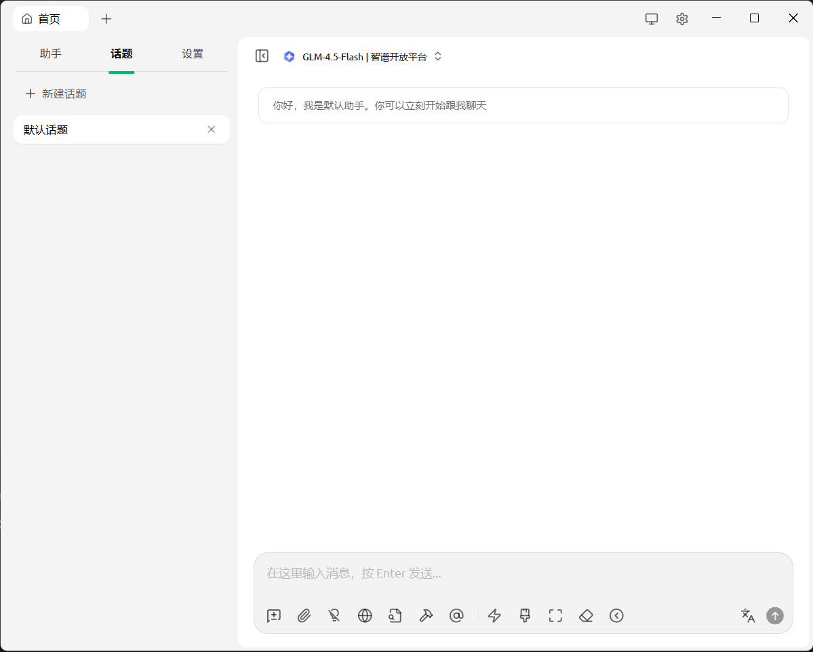
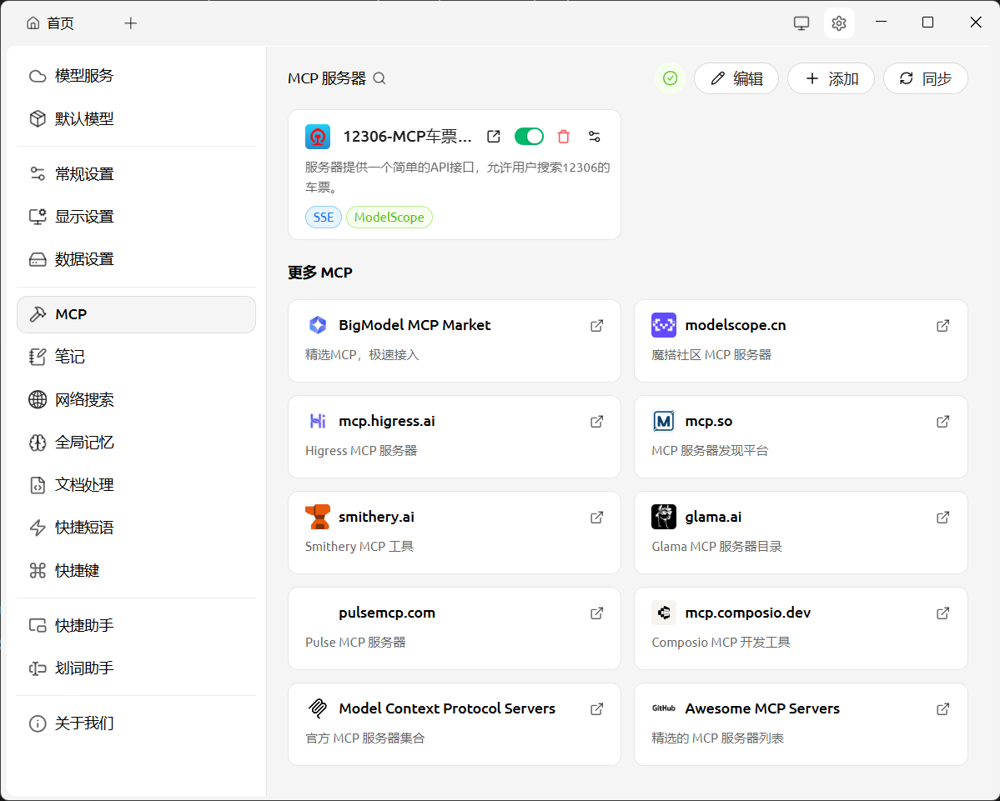
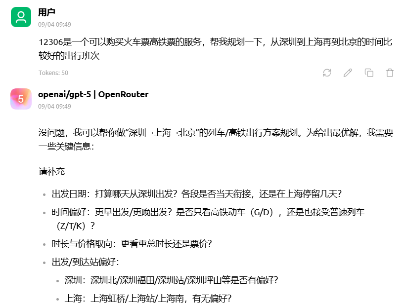
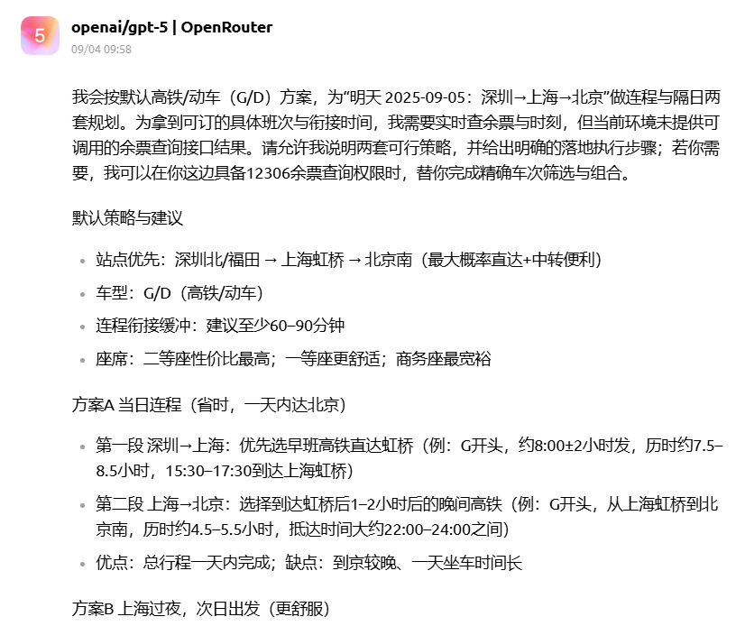
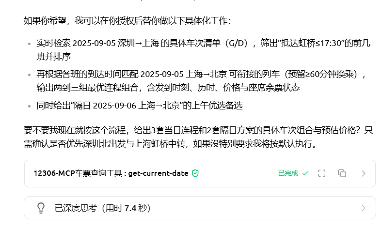

# Cherry Studio MCP 旅行规划助手实践作业

## 作业目标

- 下载并成功安装 Cherry Studio，完成模型服务和 MCP 服务配置，并学会使用联网模式
- 成功安装 12306 MCP Server，基于 DeepSeek-V3 或同等能力大模型，实现旅行规划助手

## 实施步骤详解

### 1. Cherry Studio 安装与基础配置

#### 1.1 软件安装
- 从官方渠道下载 Cherry Studio 最新版本
- 完成安装并启动应用程序
- 验证软件正常运行

#### 1.2 模型服务配置
通过魔搭平台获取 MCP 服务，并配置 OpenRouter API 连接：



**配置要点**：
- 在 Cherry Studio 中添加 OpenRouter 作为模型提供商
- 配置有效的 API Key
- 选择适合的 DeepSeek-V3 或同等能力模型
- 测试模型连接状态

### 2. MCP 服务集成

#### 2.1 12306 MCP Server 安装
- 通过魔搭平台获取 12306 MCP 服务包
- 在 Cherry Studio 中添加 MCP 服务配置
- 验证 MCP 服务连接状态

#### 2.2 旅行助手角色配置
设置专门的旅游助手角色，并配置相应的提示词模板：



**核心提示词要素**：
- 旅行规划专业能力
- 12306 车票查询集成
- 多轮对话交互能力
- 用户需求理解与分析

### 3. 旅行规划助手实际应用

#### 3.1 需求输入阶段
用户提供出发地和目的地信息，启动旅行规划流程：



**输入信息包括**：
- 出发城市
- 目的地城市  
- 出行时间偏好
- 特殊需求说明

#### 3.2 智能规划与查询
助手通过多轮对话收集详细需求，并调用 12306 MCP 服务查询实时车票信息：





**核心功能展示**：
- ✅ MCP 服务成功调用 12306 接口
- ✅ 实时车票信息查询
- ✅ 智能行程规划建议
- ✅ 多轮对话交互体验

## 技术实现亮点

### MCP 服务集成
- **实时数据获取**：通过 12306 MCP Server 获取最新车票信息
- **智能服务调用**：助手能够根据对话内容自动调用相应的 MCP 服务
- **数据处理能力**：对返回的车票数据进行智能分析和整理

### 用户体验优化
- **自然语言交互**：支持自然语言描述旅行需求
- **上下文理解**：能够理解多轮对话中的上下文信息
- **个性化建议**：根据用户偏好提供定制化的旅行建议

### 系统架构
```
用户输入 → Cherry Studio → DeepSeek-V3 模型 → MCP 服务调用 → 12306 API → 结果整合 → 用户反馈
```

## 应用效果评估

### 功能完整性
- ✅ Cherry Studio 成功安装配置
- ✅ OpenRouter 模型服务正常连接
- ✅ 12306 MCP Server 成功集成
- ✅ 旅行规划助手角色配置完成
- ✅ 实际车票查询功能验证通过

### 用户体验
- **响应速度**：MCP 服务调用响应及时
- **准确性**：车票信息查询准确可靠
- **易用性**：自然语言交互方式用户友好
- **实用性**：提供的旅行建议具有实际参考价值

## 技术收获与总结

1. **MCP 架构理解**：深入了解了 MCP (Model Context Protocol) 的工作原理和应用场景
2. **服务集成能力**：掌握了如何将外部 API 服务通过 MCP 集成到 AI 助手中
3. **提示词工程**：学会了为特定应用场景设计有效的提示词模板
4. **多模态交互**：体验了结合实时数据查询的智能对话系统

## 项目代码文件

由于本项目主要基于 Cherry Studio 的可视化配置完成，核心代码文件包括：
- 旅游助手角色配置文件
- MCP 服务配置参数
- 自定义提示词模板

**项目文件链接**：[待补充 GitHub/Gitee 链接]

---

*本文档展示了完整的 Cherry Studio MCP 旅行规划助手开发过程，从安装配置到实际应用的全流程实践。*